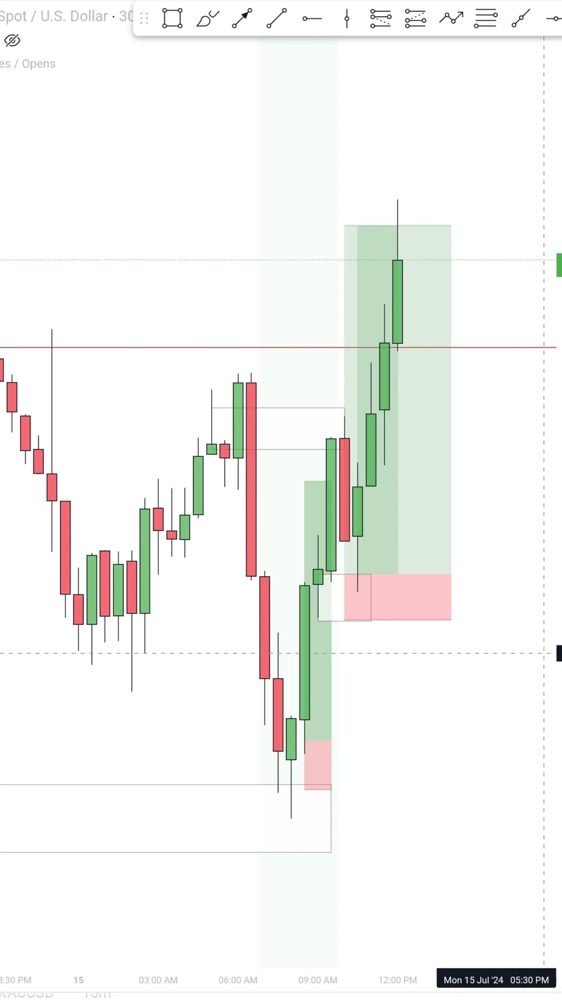
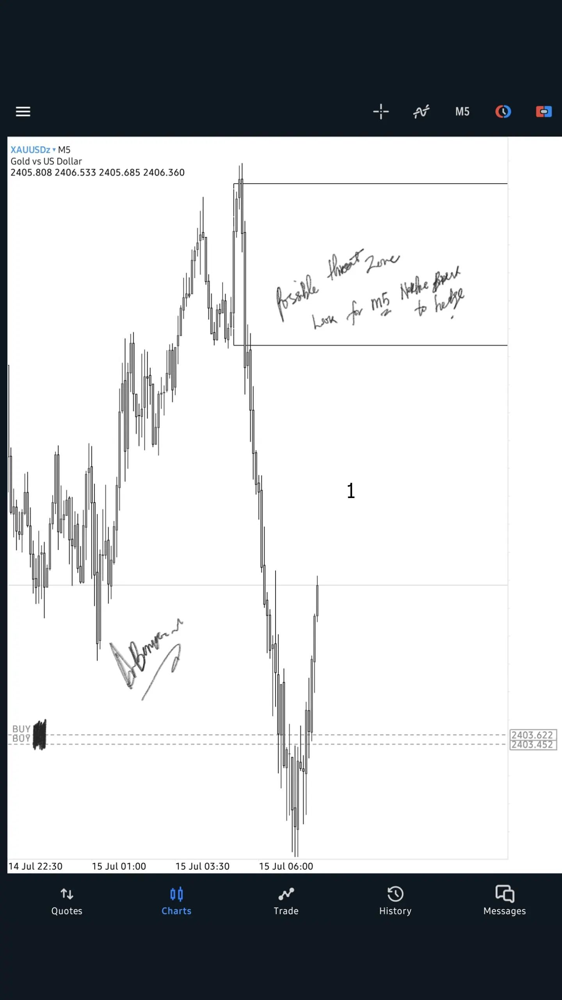
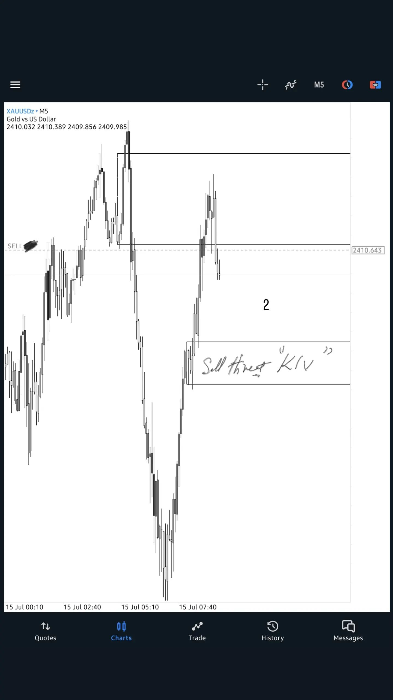
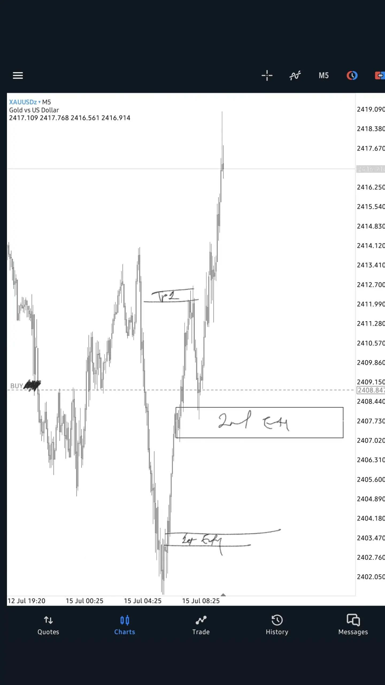
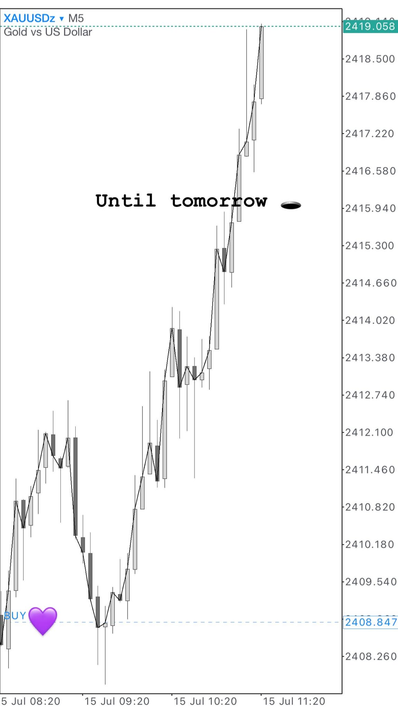

## [`mProfile-jul2024`](https://www.forexfactory.com/calendar?month=jul.2024)
<!-- :file_folder: [`?mProfile-jul2024`](https://www.forexfactory.com/calendar?month=jul.2024)  -->
<!-- -------------------------------------------------------------------------------------------------------------------------------------------------------- -->
| `wProfile` | fxFactory | `MON` | `TUE` | `WED` | `THU` | `FRI` |  
| :---: | :---: | :---: | :---: | :---: | :---: | :---: |  
| [:notebook:](#wProfile-jun29) | [`?week=jun29.2024`](https://www.forexfactory.com/calendar?week=jun29.2024) | `-` | `-` | `-` | `-` | `-` |  
| [:notebook:](#wProfile-jul06) | [`?week=jul06.2024`](https://www.forexfactory.com/calendar?week=jul06.2024) | [`jul08-s`](#jul08-s) | [`jul09-s`](#jul09-s) <br/> [`jul09-l`](#jul09-l) | [`jul10-s1`](#jul10-s1) <br/> [`jul10-s2`](#jul10-s2) | [`jul11-l1`](#jul11-l1) <br/> [`jul11-l2`](#jul11-l2) | [`jul12-s1`](#jul12-s1) <br/> [`jul12-s2`](#jul12-s2) <br/> [`jul12-s3`](#jul12-s3) <br/> [`jul12-l1`](#jul12-l1) <br/> [`jul12-s4`](#jul12-s4)|  
| [:notebook:](#wProfile-jul13) | [`?week=jul13.2024`](https://www.forexfactory.com/calendar?week=jul13.2024) | [`jul15-l`](#jul15-l) | `-` | [`jul17-s`](#jul17-s) :gem: | [`jul18-s`](#jul18-s) :gem: | [`jul19`](#jul19) :gem: |  
| [:notebook:](#wProfile-jul20) | [`?week=jul20.2024`](https://www.forexfactory.com/calendar?week=jul20.2024) | `-` | `-` | `-` | `-` | `-` |  
| [:notebook:](#wProfile-jul27) | [`?week=jul27.2024`](https://www.forexfactory.com/calendar?week=jul27.2024) | `-` | `-` | `-` | `-` | `-` |  
<!-- -------------------------------------------------------------------------------------------------------------------------------------------------------- -->
___
## `jul08-s`


```
A+++ Short Setup: Pro Swing , Pro Internal

Pro Swing !?
HTF Bullish Business Completed
BSL[4h] cleared 2nd times
SND[4h] mitigated
HTF needs some bearish retracement

Pro Internal !?
LTF BSL cleared
LTF SSL not cleared
LTF Supply Zone needs some sort of mitigation
LTF CSS at 50% of Supply Zone
LTF -FVG confirm


Entry Time ~ 17:30
Exit Time ~ 19:30
```
[:top:](#mProfile-jul2024) <!-- -------------------------------------------------------------------------------------------------------------------------------------------------------- -->
___
## `jul09-s`

  
  

```
A+++ Short Setup: Pro Swing, Pro Internal

Pro Swing:
HTF SBS at Extreme Bottom of the Range
HTF Order Flow = Bearish[retracement]
SND[4h] mitigated

Pro Internal:
LTF Order Flow = Bearish
LTF SBS Completed 

Target = clear Previous Day Low (PDL) liquidity
Expecting HTF Protected Low being Respected

High Impact News [10:00 NY = 17:30 IR]
Entry Time ~ [10:30 NY = 18:00 IR] 
Exit Time ~ [11:30 NY = 19:00 IR]
```
[:top:](#mProfile-jul2024) <!-- -------------------------------------------------------------------------------------------------------------------------------------------------------- -->
___
## `jul09-l`


[:top:](#mProfile-jul2024) <!-- -------------------------------------------------------------------------------------------------------------------------------------------------------- -->
___
## `jul10-s1`


```
B Short Setup: Counter Swing, Pro Internal !? 
1. there is a Weak High above the market 
2. the HTF Supply Zone ( SND[4h] ) is attached to Weak High
3. Lot of Engineering Liquidity below the market
4. two BISI[4h] below the market
5. tomorrow is the CPI day

Enter the market after High Impact News [10:00 NY]
SL = above SND[4h]
TP = exactly at the 1st area of LTF Demand Zone (!? B Short Setup)

Entry Time ~ [10:10 NY = 17:40 IR]
Exit Time ~ [11:00 NY = 18:30 IR]

```
[:top:](#mProfile-jul2024) <!-- -------------------------------------------------------------------------------------------------------------------------------------------------------- -->
___
## `jul10-s2`

```
B Short Setup: Counter Swing, Pro Internal !? 
1. Lot of Engineering Liquidity below the market 
2. two BISI[4h] below the market
3. tomorrow is the CPI day

SL = above LTF SBS 
TP = exactly below Engineering Sell Side Liquidity (SSL)

Entry Time ~ [12:13 NY = 19:43 IR]
Exit Time ~ [13:45 NY = 21:15 IR]
```
[:top:](#mProfile-jul2024) <!-- -------------------------------------------------------------------------------------------------------------------------------------------------------- -->
___
## `jul11-l1`


```
A+++ Long Setup: Pro Swing, Pro Internal

Entry Time ~ [12:13 NY = 19:43 IR]
Exit Time ~ [13:45 NY = 21:15 IR]
```
[:top:](#mProfile-jul2024) <!-- -------------------------------------------------------------------------------------------------------------------------------------------------------- -->
___
## `jul11-l2`


```
1. Partial Close Previous Position.
2. Holding Some parts of previous position.
3. Placing SL at breakeven.
```
[:top:](#mProfile-jul2024) <!-- -------------------------------------------------------------------------------------------------------------------------------------------------------- -->
___
## `jul12-s1`


```
HTF Bullish Business Completed !? daily -OB mitigated
next target is: mitigation last HTF Resistance area.

Current OF = bearish
HTF target = mitigation of HTF Previous Broken Resistance

Stopping at 50% of SIBI[4h] is the sign of remaining unfilled.
Remaining unfilled of SIBI[4h] is the sign of that price is in hurry for reaching to HTF objectives. 

SL = above 50% of the SIBI[4h]
TP = below the 1st LTF swing !? 
1.today is friday and price has less volatility than other trading days.
2.there is so many times before High Impact News [PPI] at 08:30 NY

Entry Time ~ [01:49 NY = 09:19 IR]
Exit Time ~ [02:31 NY = 10:01]
Duration ~ 42m

```
[:top:](#mProfile-jul2024) <!-- -------------------------------------------------------------------------------------------------------------------------------------------------------- -->
___
## `jul12-s2`

```
Trend is Your Friend 

Entry Time ~ [04:39 NY = 12:10 IR]
Exit Time ~ [06:29 NY = 13:58 IR]
Duration ~ 1h48m
```
[:top:](#mProfile-jul2024) <!-- -------------------------------------------------------------------------------------------------------------------------------------------------------- -->
___
## `jul12-s3`

```
Before High Impact News [PPI] at [08:30 NY]
Anticipating High Impact News Move 

Entry Time ~ [08:21 NY = 15:51 IR]
Exit Time ~ [08:31 NY = 16:01 IR]
Duration ~ 10m
```
[:top:](#mProfile-jul2024) <!-- -------------------------------------------------------------------------------------------------------------------------------------------------------- -->
___
## `jul12-l1`


```
1. Price reaches to HTF objectives.
2. HTF Bearish Business completed.
3. all day was bearish, now its time to form the Bullish Order Flow (Pro Swing, Pro Internal)
4. Lower Low forms at HTF important level.
```
[:top:](#mProfile-jul2024) <!-- -------------------------------------------------------------------------------------------------------------------------------------------------------- -->
___
## `jul12-s4`


```
1. Price reaches to HTF objectives.
2. HTF Bullish Business completed.
3. now, we are entered in the last h4 of the trading day.
4. in LTF price respected to the HIGH of last supply zone.
5. there is some engineering liquidity below the market.
6. enter to the bearish setup using -FVG.
7. put your SL above the HIGH of last supply zone.
8. put you TP exactly at the 1st line of LTF demand zone. !? (1. Friday 2.Last h4)
```
[:top:](#mProfile-jul2024) <!-- -------------------------------------------------------------------------------------------------------------------------------------------------------- -->
___
### `#wProfile-jul06`

[:top:](#mProfile-jul2024) <!-- -------------------------------------------------------------------------------------------------------------------------------------------------------- -->
___
## `jul15-l` 


```
A+++ Long Setup: Pro Swing, Pro Internal
```

[`@phronesisknight`](https://www.instagram.com/phronesisknight/)
<table><tr>
<td></td>
<td></td>
<td></td>
<td></td>
<td></td>
</tr></table>


[:top:](#mProfile-jul2024) <!-- -------------------------------------------------------------------------------------------------------------------------------------------------------- -->
___
## `jul17-s` 


```
1. Same chart[h4] with difference between OANDA & SAXO, base on the starting hour of trading day [17:00 or 18:00 NY].
2. OANDA trading day starts from [17:00 NY] (like my broker)
3. SAXO trading day starts from [18:00 NY]
```


[:top:](#mProfile-jul2024) <!-- -------------------------------------------------------------------------------------------------------------------------------------------------------- -->
___
## `jul18-s` 
### Despite having lack-of-volume above/below the market, Why there is different type of move inside POIs !?

### Supportive Move (it has smart money support so there is a stronger move than CSS in 50% of the POI)

### Direct Move (doing its job to horrify retail-traders) 


```
How price entered to a POI is important how to trade that POI !?
if price entered to a POI using direct move, then uses CSS for trade. 
if price entered to a POI using supportive move then uses RESPECT | LG | FVG for trade.

Price did its job to horrify retail-traders:
- Retail-traders are traders who looks ONLY at LTF and see ONLY the strong move on LTF.
- Retail-traders see the LTF strong move as a trend and they don't see that as Mitigation or Liquidity Grab.
- Retail-traders are fearful to take the trade against LTF strong move.
```


[:top:](#mProfile-jul2024) <!-- -------------------------------------------------------------------------------------------------------------------------------------------------------- -->
___
## `jul19` 
### 2 charts, from different brokers (FXCM | OANDA) on the same asset (xauusd).


___
[:top:](#mProfile-jul2024) <!-- -------------------------------------------------------------------------------------------------------------------------------------------------------- -->
<!--
## `jul08`
| 🟡 `How to hunt huge moves using HTF analysis` |
| :--- |
|  |
|  |
|  |
|  |
|  |
|  |
|  |
|  |
|  |
|  |
-->