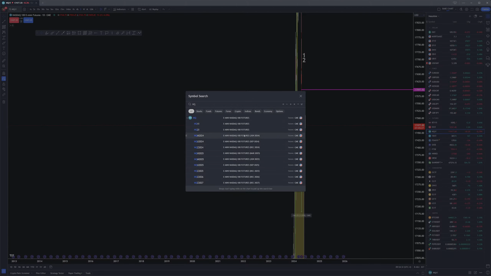
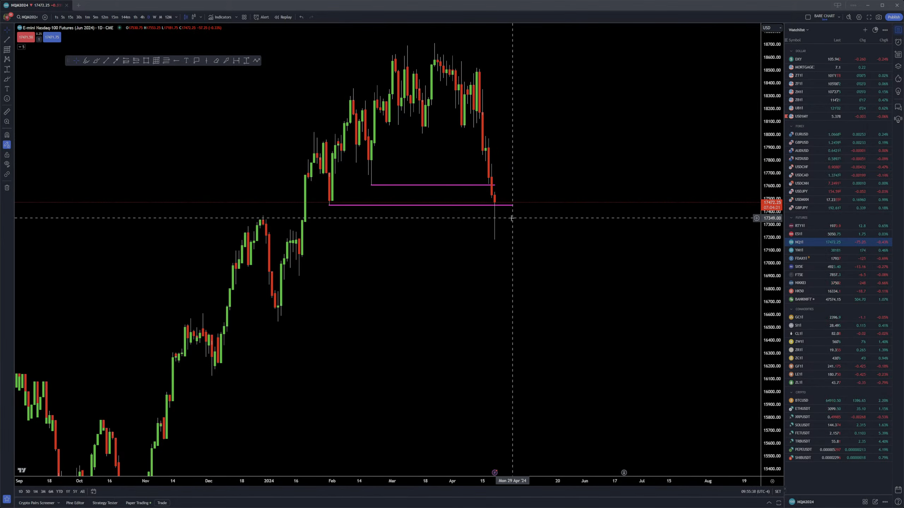
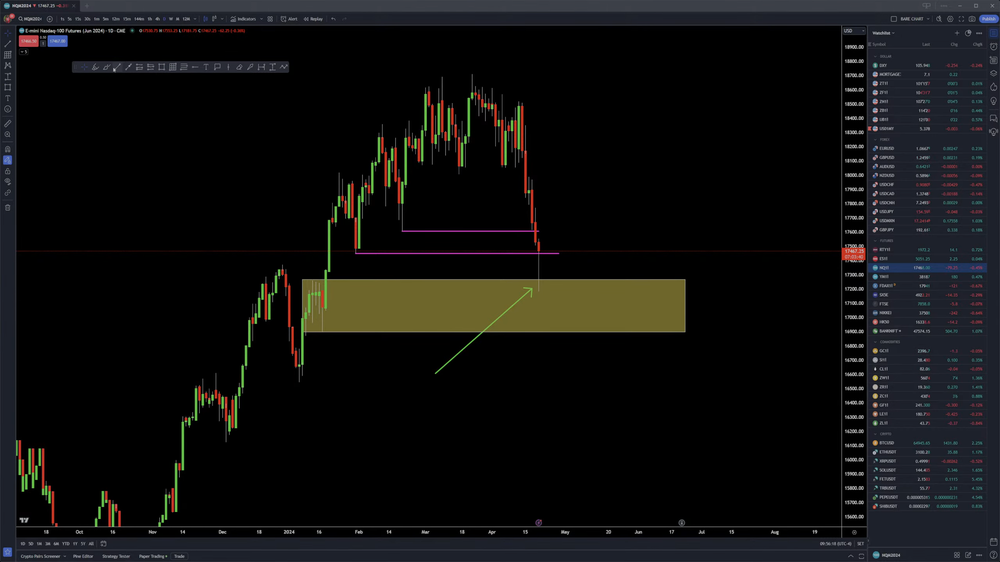
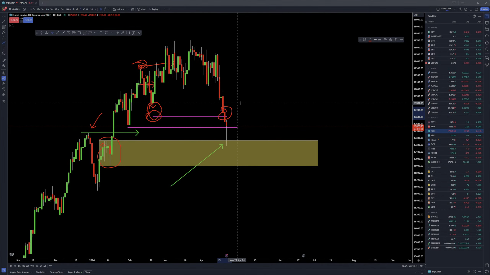
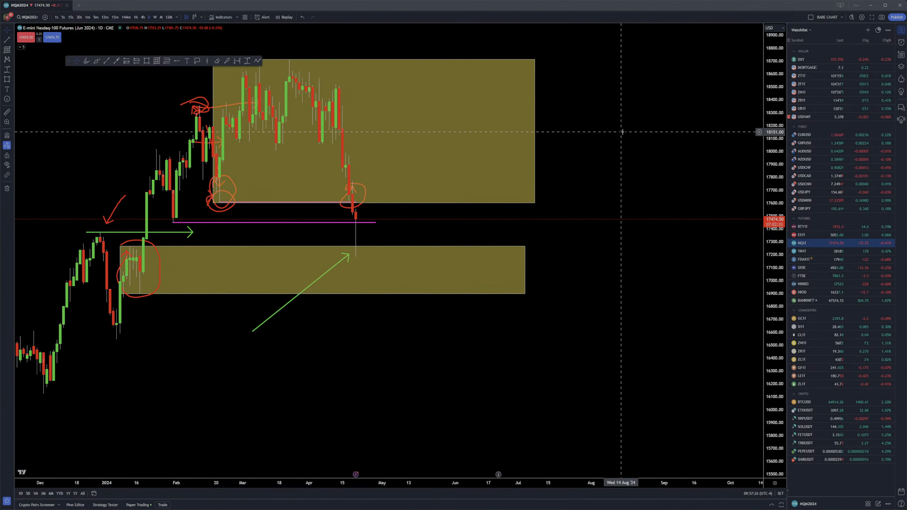
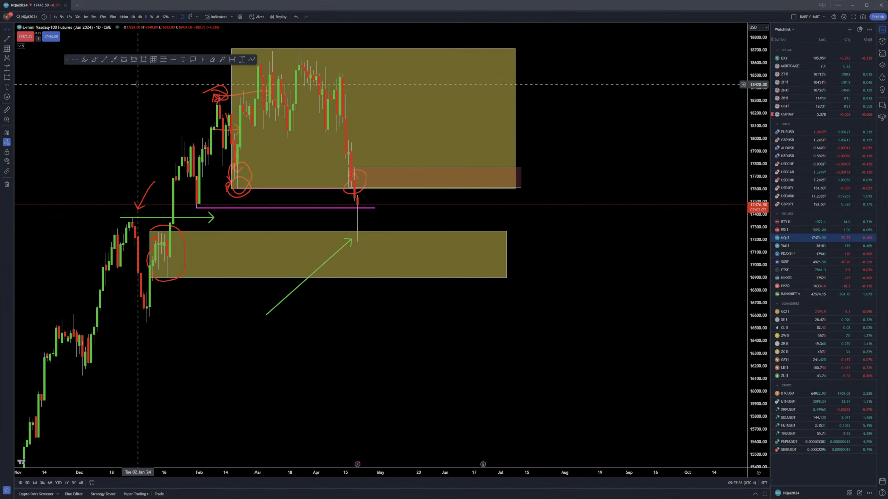
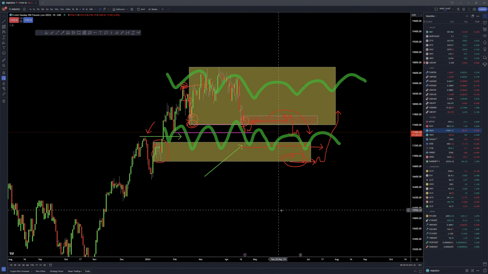

___
### Live Futures Trading | YEET! | April 19th, 2024

___
#### Current Contract 

___
#### these HTF moves is not your business as day trader: trying to figure out if this LOW is taken, does that mean that now we go back up.

___
#### your business is: after these HTF lows get taken with Force (these people are ran out) you have enough money at that point to be able to buy back up.

___
#### Protected Low

___
#### Responsible for taking Protected Low

___
#### so when we bring up the Previous Range

___
#### fractal:

___
#### You need to trade in an accumulating mindset: -The Bottom of the range -The Top of the range
#### when we accumulate that creates: -enough orders -enough momentum, for us to either expand higher or trade lower

___
#### My BackTesting  

___
#### BTCUSD (same scenario: when we get HTF highs, then consolidating  between two ranges)

___
#### NQ! (same scenario: when we get HTF highs, then consolidating  between two ranges)

___

209
1. Tops\Bottom of the Range (Extremes)
3. Close Below\Above the Range
4. Trade Back to the Bottom\Tops of the Range

262
range has structure on a LTF

319
instead of trying to pick tops & bottoms based on the HTF, trade with ranged mindset.
